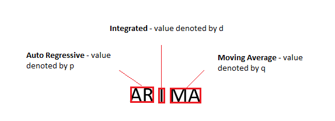
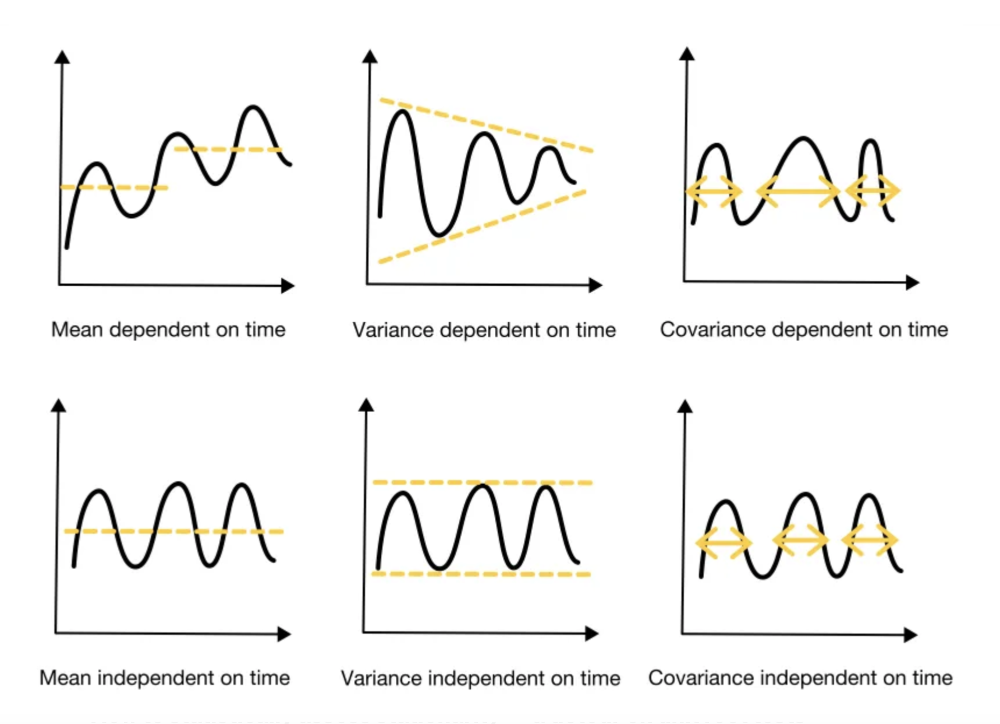
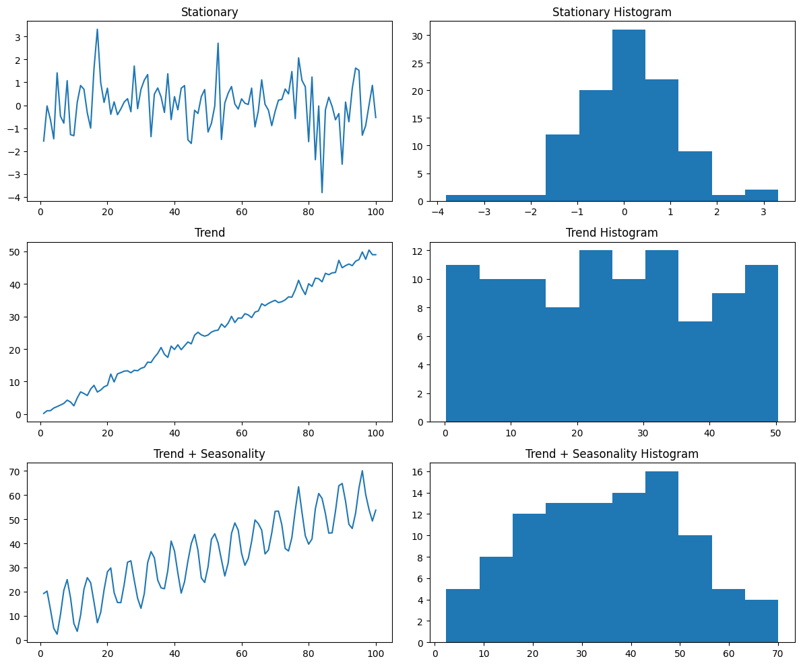
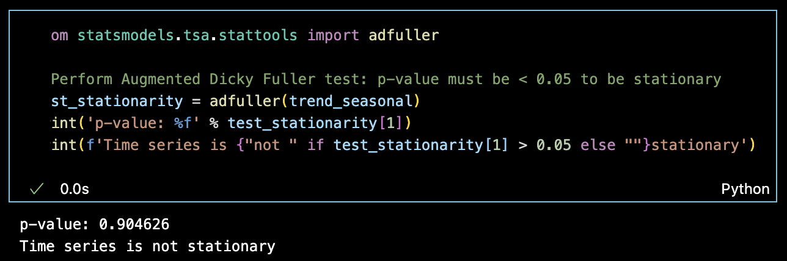
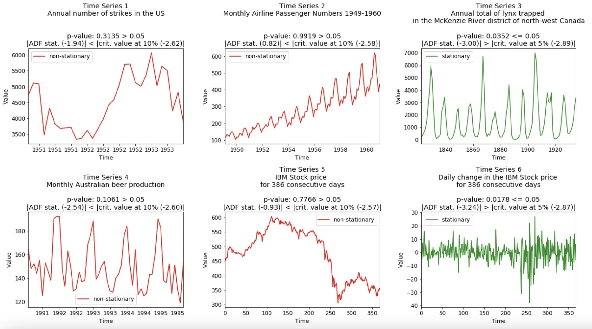

# ARIMA

## 1. What is ARIMA?

ARIMA (AutoRegressive Integrated Moving Average) is a statistical model used for time series forecasting. It combines three components:

1. AutoRegressive (AR): The model uses past values to predict future ones.
2. Integrated (I): Differencing is applied to make the time series stationary.
3. Moving Average (MA): Past forecast errors are used to refine predictions.

## ARIMA Mathematical Formulas

### **AutoRegressive (AR) Model**
Yₜ = c + φ₁ Yₜ₋₁ + φ₂ Yₜ₋₂ + ... + φₚ Yₜ₋ₚ + εₜ

The actual value is based on the sum of partial former values (also called **lagged** values). Like the temperature of today is heavily correlated with the temperature of yesterday.

### **Moving Average (MA) Model**
Yₜ = εₜ + θ₁ εₜ₋₁ + θ₂ εₜ₋₂ + ... + θ_q εₜ₋ₛ

The actual value is based on the sum of partial **errors** of former predictions. This allows to model the impact of sudden changes

### **ARMA(p, 0, q) Model**
Yₜ = c + φ₁ Yₜ₋₁ + φ₂ Yₜ₋₂ + ... + φₚ Yₜ₋ₚ + εₜ + θ₁ εₜ₋₁ + θ₂ εₜ₋₂ + ... + θ_q εₜ₋ₛ

This is the sum of the AR + MA part. The time series is stationary so no differentiation is needed. (d=0)

### **ARIMA(p, d, q) Model**
Δ^d Yₜ = φ₁ Δ^d Yₜ₋₁ + ... + φₚ Δ^d Yₜ₋ₚ + θ₁ εₜ₋₁ + ... + θ_q εₜ₋ₛ + εₜ

## 2. ARIMA versions and libraries

### 2.1 ARIMA versions

### Comparison of ARIMA, SARIMA and SARIMAX

| Model      | Seasonal Component | Exogenous Variables | Use Case                                      |
|------------|---------|----------------------|-----------------------------------------------|
| **ARIMA**  | No                   | No                   | Non-seasonal time series without external influences. |
| **SARIMA** | Yes   | No                   | Time series with seasonal patterns.           |
| **SARIMAX**| Yes  | Yes                  | Time series with seasonal patterns and external factors.(eg: holidays, DayOfWeek, planned promotions etc) |

### 2.2 ARIMA libraries

### Comparison of ARIMA Libraries in Python

| Library         | Pros                                                 | Cons                                                 |
|-----------------|------------------------------------------------------|------------------------------------------------------|
| **statsmodels** | - Well-established library.                         | - Requires more manual steps for model selection.    |
|                 | - Provides detailed statistical outputs.            | - Slower for large datasets compared to others.      |
|                 | - Handles AR, MA, ARMA, ARIMA, and SARIMA models.   | - Less automated for hyperparameter tuning.          |
| **pmdarima**    | - Easy to use with automated hyperparameter tuning. | - May not provide as detailed diagnostics as `statsmodels`. |
|                 | - Provides auto_arima function for automatic model fitting. | - Can be slower than `statsmodels` for large datasets. |

**Remark:** Notice that although pmdarima is a wrapper around statsmodels, some functionality and syntax might slightly differ. We will be using mainly pmdarima because it offers auto_arima to automatically search for the optimal (p,d,q) combination and its ease of use.

## 3. Stationarity

**Definition:** A time series is **stationary** when all statistical parameters remain constant over time

* a constant **mean**
* a constant **variance** (= "heteroscedacity')
* a constant **autoregression** structure
* **no seasonality** = no periodic component

A more inuitive explaination is that time series that exibit this behaviour are easier to model.

### 3.1 How can we check this?

**There are 3 Options:**

1. visualy: plot the time series and try to spot:
    * a trend
    * a varying variance

    If so then the series is **NOT Stationary**

     

2. Plot the histogram of the time series

    If the histogram shows a normal distribution like the first one, then it is most likely stationary. If it has a more flat or uniform distribution like 2 and 3 then it is NOT stationary

     

3. ADF-test: Augmented Dickey-Fuller test

    The ADF test is a statistical test, that tests if the time series is **NON-stationary**. If the probability p is lower than 5% ( p < 0.05) then it is not "NOT-stationary", thus the time series is stationary.

    **Simply put: p < 0.05 means stationary**

     
    **Some examples:** 
     

## 4 Some practical scenario's

### 4.1 AR proces

#### AR(1) Process Example: Estimating Gold Prices

We will use an **Autoregressive (AR) process with 1 lag (AR(1))** to estimate the gold price based on past values.

#### Given Data
The real-world gold prices for 10 days:

`(4, 6, 6, 8, 7, 6, 4, 3, 3, 4)`

We apply the **AR(1) formula**:

$P_t$ = μ + φ * $P_(t-1)$ + $ε_t$

where:
- `P_t` is the **predicted** gold price at time `t`.
- `μ = 1.625311` (Intercept).
- `φ = 0.6608` (Coefficient for the previous day's price `P_(t-1)`).
- `P_(t-1)` is the **actual** gold price from the previous day.
- `ε_t` is the **error term** (assumed to be small and ignored for simplicity).

#### Step-by-Step Predictions Using AR(1)

| Day | Real Price (P_t) | Predicted Price (P̂_t) |
|----|---------------|----------------------------------|
| 1  | **4**         | -                                |
| 2  | **6**         | `1.625311 + 0.6608 * 4 = 4.2685` |
| 3  | **6**         | `1.625311 + 0.6608 * 6 = 5.5901` |
| 4  | **8**         | `1.625311 + 0.6608 * 6 = 5.5901` |
| 5  | **7**         | `1.625311 + 0.6608 * 8 = 6.9117` |
| 6  | **6**         | `1.625311 + 0.6608 * 7 = 6.2509` |
| 7  | **4**         | `1.625311 + 0.6608 * 6 = 5.5901` |
| 8  | **3**         | `1.625311 + 0.6608 * 4 = 4.2685` |
| 9  | **3**         | `1.625311 + 0.6608 * 3 = 3.6077` |
| 10 | **4**         | `1.625311 + 0.6608 * 3 = 3.6077` |

#### Analysis of Predictions
1. The **predicted values are close** to the actual values, but there are some deviations.
2. The **AR(1) model smooths fluctuations**, meaning it does not perfectly capture sharp jumps.
3. The model **relies on past values** and does not incorporate external factors such as economic news, supply-demand shocks, or geopolitical events.

#### Conclusion
This example demonstrates how an **AR(1) process** can be used to estimate **gold prices** based on historical values. The model assumes **a dependency on the previous day's price** and provides a reasonable estimate of future values.

### 4.2 MA proces - example

#### Cloud Cover and Solar Energy

#### Given MA(1) Formula
$S_t$ = μ + $ε_t$ + θ₁ $ε_{t-1}$

where:  
- $S_t$ = Solar energy deviation on day t (as a percentage change from expected production).  
- μ = 0 (assuming we measure deviations from the norm).  
- $ε_t$ = Unexpected cloud cover impact today.  
- θ₁ = 0.5 (assuming yesterday's cloud effect still influences today).  
- $ε_{t-1}$ = Yesterday’s unexpected cloud cover impact.  

---

### Day-by-Day Calculation

#### Day 1: A Sudden Thunderstorm
- $ε_1$ = -30% (unexpected severe cloud cover).  
- No previous day effect ($ε_0$ = 0).  
- **Formula:**  
  $S_1$ = 0 + (-30) + (0.5 × 0) = -30%

#### Day 2: Lingering Clouds
- $ε_2$ = -10% (still some unexpected clouds).  
- Yesterday's impact: $ε_1$ = -30%.  
- **Formula:**  
  $S_2$ = 0 + (-10) + (0.5 × -30) = -10 - 15 = -25%

#### Day 3: Clear Sky Returns
- $ε_3$ = 0% (no unexpected clouds today).  
- Yesterday's impact: $ε_2$ = -10%.  
- **Formula:**  
  $S_3$ = 0 + 0 + (0.5 × -10) = -5%

#### Day 4: Normal Day
- $ε_4$ = 0% (perfectly normal, expected sunlight).  
- Yesterday's impact: $ε_3$ = 0%.  
- **Formula:**  
  $S_4$ = 0 + 0 + (0.5 × 0) = 0%

---

#### Final Solar Energy Deviations Over Time

| Day | Unexpected Cloud Cover ($ε_t$) | Solar Output Deviation ($S_t$) |
|-----|------------------------------|------------------------------|
| 1   | -30%                         | -30%                         |
| 2   | -10%                         | -25%                         |
| 3   | 0%                           | -5%                          |
| 4   | 0%                           | 0%                           |

This example shows how **today’s solar energy deviation is influenced by today’s and yesterday’s unexpected weather conditions**—a classic **MA(1) process**.
